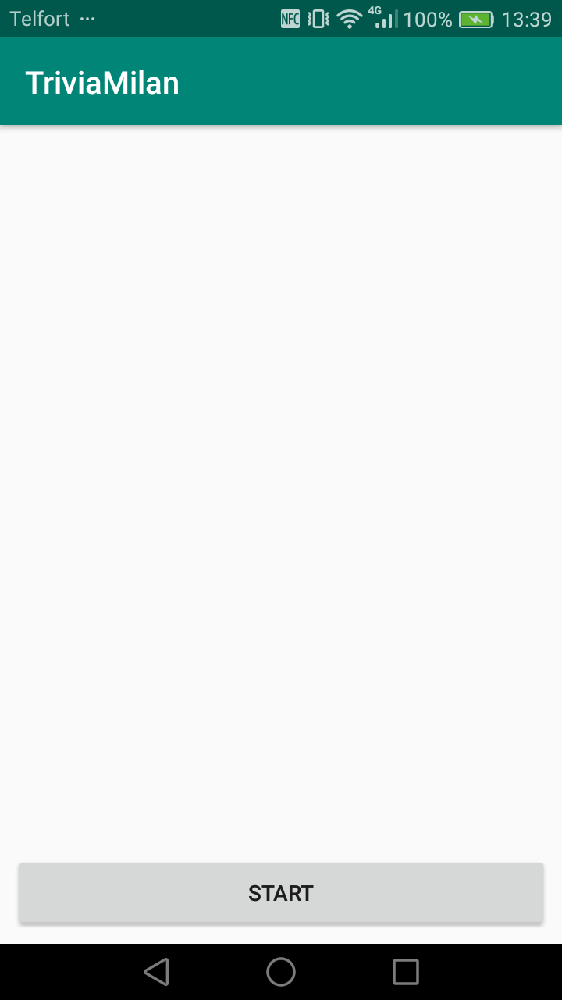
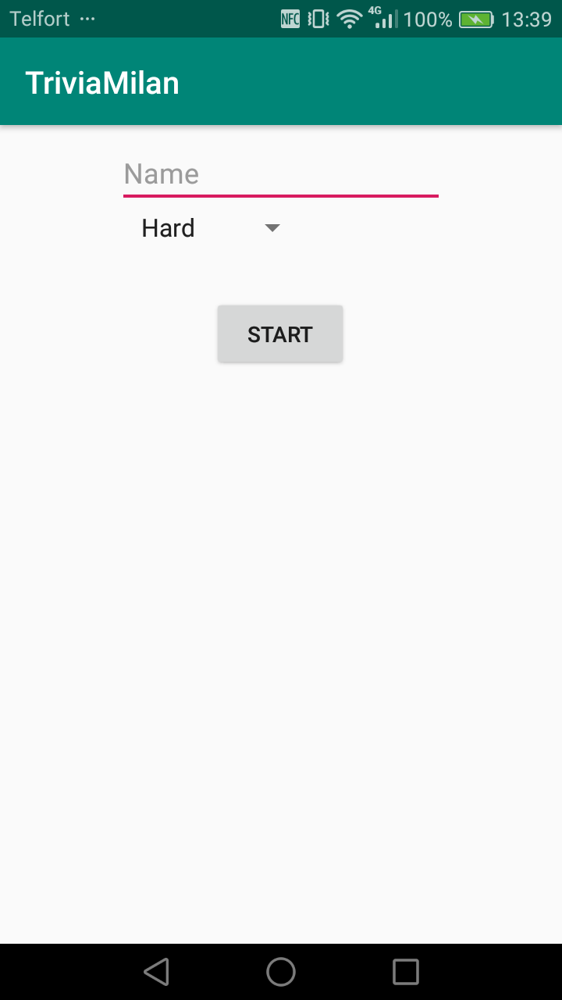
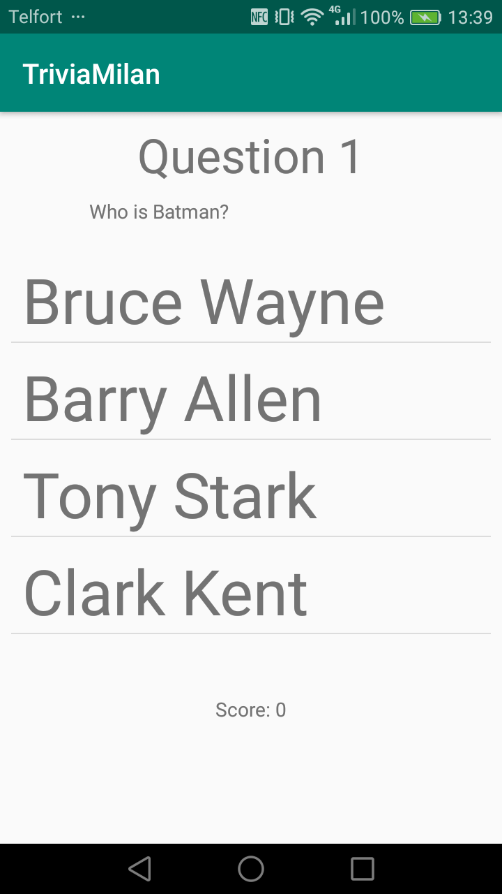
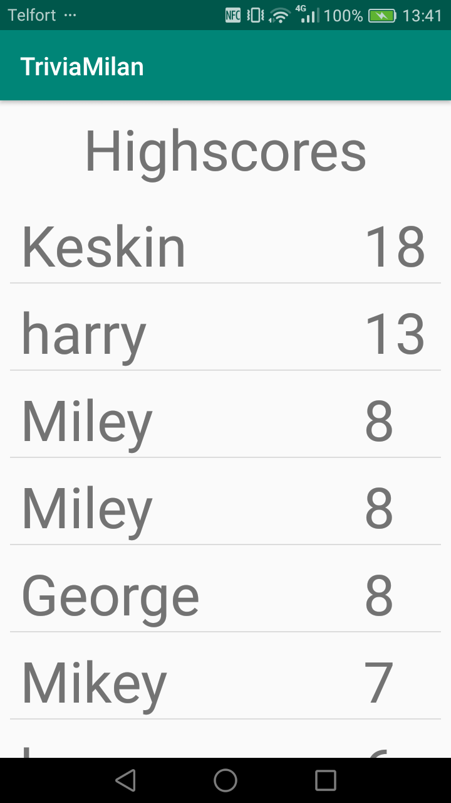

# TriviaMilanScholten-master
Final Push. Layout issues fixed also navigating back from highscorelist does not allow user to go back to questions. Up to date with Read me

Final Assignment of the course App Studio of the minor Programmeren at the UvA.
Let's the user play trivia by posing 25 questions of the selected difficulty from an API. Only when all the questions are answered will the player be added to the highscorelist.

